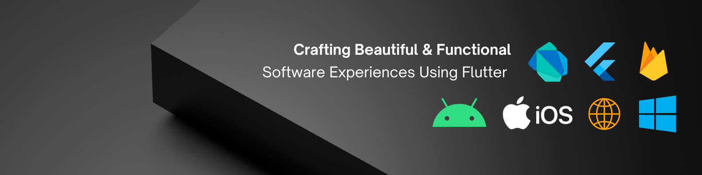

<h1 align="center">Hi 👋, I'm Fadli Al Akbar</h1>
<h3 align="center">A Passionate Flutter Developer From Indonesia</h3>

  

- 👯 I’m looking to collaborate on **Flutter Developmet**

- 👨‍💻 All of my projects are available at [here](https://www.notion.so/fadliakbar/0cebe2bb043e42fab8cef5951da54521)

- 📝 I regularly write articles on [here at medium](https://medium.com/@fadlialakbar)

- 💬 Ask me about **Flutter, Dart, Android, IOS, and Website**

- 📫 How to reach me **fadlialakbar.contact@gmail.com**

- 📄 Know about my experiences [here at linkedin](https://www.linkedin.com/in/fadlialakbar/)

<h3 align="left">Connect with me:</h3>

